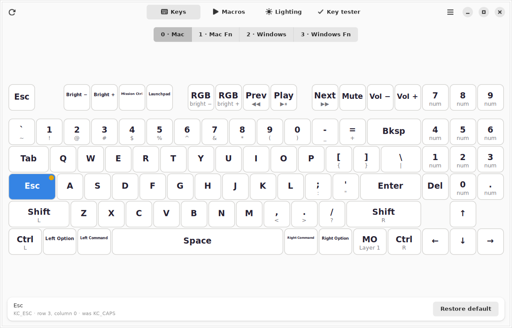
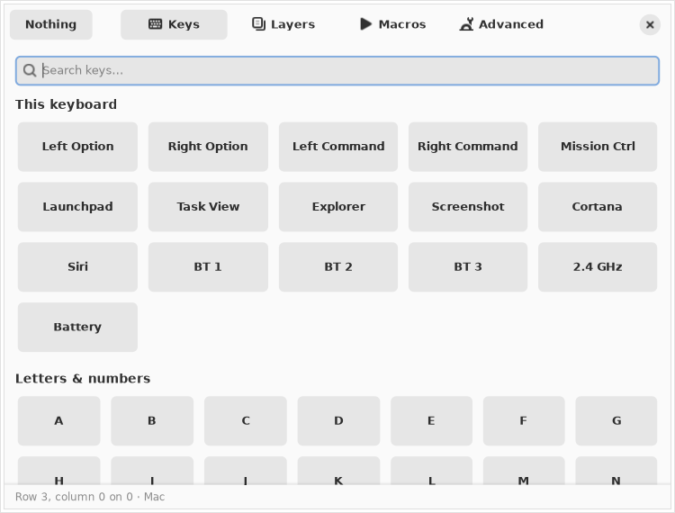
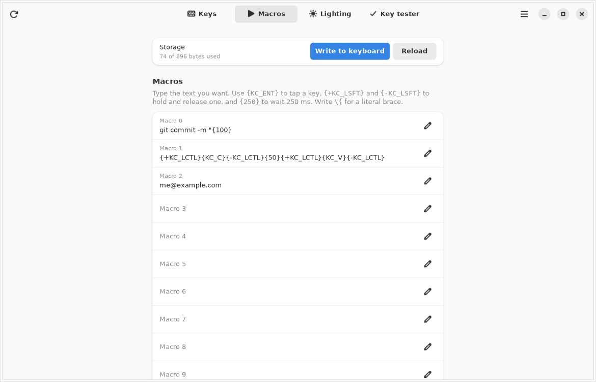
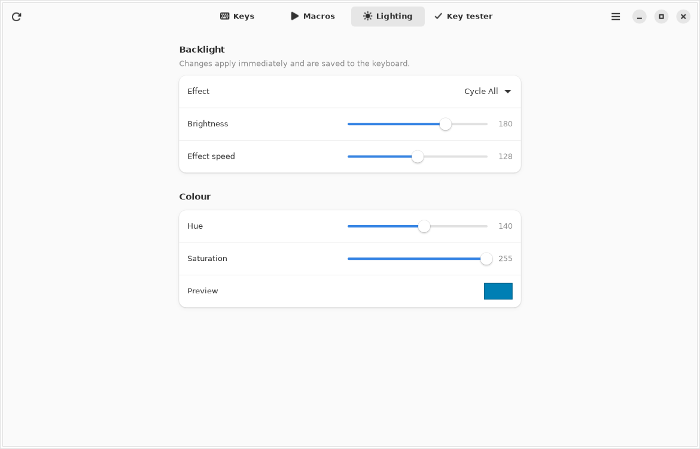
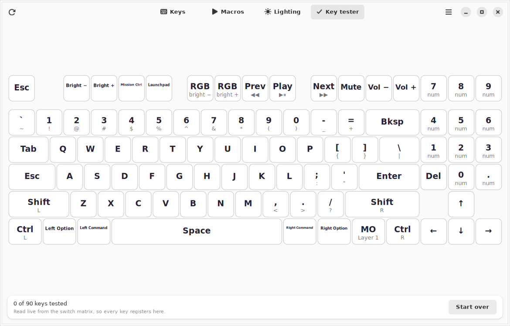

# Keychron Zen Launcher

A native Linux app for configuring QMK/VIA Keychron keyboards — remap keys,
edit macros, set the backlight, test switches — without installing Chrome,
Chromium, Edge or Opera.

Built for a **Keychron K13 Max** on **Bazzite**, packaged as a Flatpak, and
started only when you open it.



## Why this exists

Keychron Launcher is a fork of VIA, and both talk to the keyboard through
**WebHID**. WebHID is a Chromium-only API — Mozilla
[formally opposes it](https://mozilla.github.io/standards-positions/#webhid),
so it is not in Firefox and therefore not in Zen Browser, Librewolf, or
anything else built on Gecko.

That means a "Keychron Launcher clone that runs in Zen" cannot exist: no Gecko
browser can open a USB HID device at all. Something native has to talk to
`/dev/hidraw`.

So this is that native something. It speaks the same VIA protocol Keychron's
web app does, straight to the keyboard, from a GTK 4 window.

## What it does

**Remap any key, on any layer.** Click a key, pick what it should do. The
change is written to the keyboard immediately — there is no separate flash
step, and nothing is lost if you close the app. Keys you have changed from the
factory keymap are marked with a dot, and each one can be put back on its own.

**A key picker that covers all of QMK**, not just letters: layer switching
(`MO`, `TG`, `TO`, `OSL`, `TT`, `DF`), macros, modifiers, media and system
keys, mouse keys, the Keychron-specific keys like Bluetooth host switching and
battery level — and a free-text field for tap-hold and combination keycodes
such as `LT(1,KC_SPC)`, `LCTL_T(KC_ESC)` or `LCTL(LSFT(KC_A))`.



**Macros.** All sixteen slots, in a text form that says what it does:
`git commit -m "` types text, `{+KC_LCTL}{KC_C}{-KC_LCTL}` holds and releases,
`{250}` waits. The page tracks how much of the keyboard's shared macro buffer
you have used and refuses to write something that will not fit.



**Backlight.** Effect, brightness, speed, and — on RGB models — hue and
saturation, applied live and saved to the keyboard. The effect list is the one
your exact model's firmware was built with, not a generic list, so the names
match what the keys actually do.



**A key tester** that reads the switch matrix directly out of the firmware.
Because it does not listen for key events, it registers every key regardless of
what it is mapped to, whether the window has focus, or whether the key types
anything at all.



**Save and load your whole setup** as readable JSON — keymap, macros and
lighting — good for backups and for keeping your layout in version control:

```json
{
  "format": "keychron-zen-launcher",
  "keyboard": { "name": "Keychron K13 Max — ANSI, RGB backlight", "product_id": "0x0AD0" },
  "layers": [
    { "name": "0 · Mac", "keys": [["KC_ESC", "KC_NO", "KC_BRID", "..."]] }
  ],
  "macros": ["me@example.com"],
  "lighting": { "effect": 4, "effect_name": "Cycle All", "brightness": 180 }
}
```

## Requirements

- Linux, with GTK 4 and libadwaita 1.5 or newer (Bazzite, and any current
  GNOME or KDE system, already has both)
- A Keychron QMK/VIA keyboard, **connected with its USB cable**
- No Python packages. The app has zero third-party Python dependencies

## Install

### Flatpak (recommended on Bazzite)

Bazzite's filesystem is immutable, so this layers no RPM and touches nothing in
`/usr`:

```bash
git clone https://github.com/bkravets06/keychron-zen-launcher.git
cd keychron-zen-launcher
./scripts/build-flatpak.sh
```

That installs the GNOME 48 runtime if it is missing, builds the app, and
installs it for your user only. It then appears in the app grid as
**Keychron Zen Launcher**.

### Straight from the source tree

No install, no packaging — useful for a quick try:

```bash
./scripts/run-from-source.sh
```

### The udev rule — needed either way

Configuration happens over a raw HID interface whose `/dev/hidraw` node is
root-only by default. One udev rule hands access to whoever is logged in:

```bash
sudo ./scripts/install-udev-rule.sh
```

Then **unplug and replug the keyboard**. Without this the app will find your
keyboard and tell you it is not allowed to open it.

The rule is a single file in `/etc/udev/rules.d`, which is preserved across
Bazzite image updates. It uses `TAG+="uaccess"`, which grants access to the
user at the seat through an ACL rather than opening the device to everything on
the machine.

## Use the cable

Keychron's firmware only accepts configuration over USB. In Bluetooth or
2.4 GHz mode the keyboard does not expose the interface this app needs, so:

- Slide the side switch to the **cable** position
- Plug the USB-C cable in

If you connect over Bluetooth anyway, the app says so instead of silently
finding nothing.

## Nothing runs in the background

By design:

- No systemd unit, no daemon, no autostart entry, no tray icon
- Nothing is registered to start at login
- Closing the window ends the process; the `/dev/hidraw` handle is released
- The Flatpak has **no network permission** and **no filesystem permission** —
  saving and loading configuration files goes through the file chooser portal,
  which grants access to the one file you pick

To remove everything:

```bash
flatpak uninstall --user io.github.bkravets06.KeychronZenLauncher
sudo ./scripts/uninstall-udev-rule.sh
```

## Supported keyboards

The **Keychron K13 Max** is bundled in all four variants, with the correct
90-key ANSI and 91-key ISO layouts, the right lighting effects for each, and
the stock keymap for "restore default":

| Variant | USB id | Layout | Backlight |
| --- | --- | --- | --- |
| ANSI, RGB | `3434:0AD0` | 90 keys | RGB matrix, 23 effects |
| ISO, RGB | `3434:0AD1` | 91 keys | RGB matrix, 23 effects |
| ANSI, white | `3434:0AD3` | 90 keys | LED matrix, 15 effects |
| ISO, white | `3434:0AD4` | 91 keys | LED matrix, 15 effects |

Any other VIA keyboard will still connect, and its macros and backlight can be
configured, but remapping needs a layout definition. Adding one is a single
command against Keychron's QMK fork:

```bash
tools/qmk_layout_import.py --board k10_max \
  --out src/keychron_zen/model/keyboards/k10_max.json
```

Check what the app can see, and why anything it found is unusable:

```bash
keychron-zen-launcher --list-devices
```

## How it works

**Transport.** `/dev/hidraw` is opened directly — no `hidapi`, no C extension.
A keyboard exposes several HID interfaces, so the report descriptor of each is
parsed to find the one with usage page `0xFF60` and usage `0x61`, which is
QMK's raw HID interface. Enumeration reads `/sys/class/hidraw`, which is
world-readable, so the app can tell "no keyboard" apart from "keyboard is there
but you lack permission" and say which it is.

**Protocol.** VIA protocol version 12, in 32-byte reports: keymap reads and
writes, the macro buffer, the lighting channels, and the switch matrix state
the key tester uses.

**Definitions.** The parts a keyboard cannot tell you about itself — how its
matrix maps onto physical keys, which lighting effects its firmware was built
with, what its stock keymap is — are generated from the metadata Keychron
publishes in [its QMK fork](https://github.com/Keychron/qmk_firmware) by
`tools/qmk_layout_import.py`, and committed as JSON. QMK numbers lighting
effects by the order of the enabled entries in `rgb_matrix_effects.inc`, so the
generator reconstructs that enum rather than assuming a fixed list.

**Keycodes.** All ~700 QMK keycodes and their aliases are generated from
`quantum/keycodes.h` by `tools/qmk_keycode_import.py`. Composite keycodes are
encoded and decoded here, and the text form round-trips exactly across the
entire 16-bit keycode space — which the test suite checks value by value,
because an asymmetry there would quietly corrupt a saved keymap.

## Development

```bash
./scripts/run-tests.sh          # 93 tests, stdlib unittest, no dependencies
./scripts/run-from-source.sh --demo
```

`--demo` runs the app against a simulated K13 Max that answers the real VIA
protocol from memory. Nothing is written to hardware, so every page can be
explored with no keyboard plugged in — and the same simulator backs the tests.

```
src/keychron_zen/
  protocol/    hidraw transport, VIA protocol, keycodes, macros, simulator
  model/       keyboard definitions and the open-session facade
  ui/          GTK 4 window, drawn keyboard, pages, key picker
tools/         generators that produce the committed JSON from QMK metadata
```

## Credits

The protocol, keycode values and keyboard metadata all come from
[QMK](https://github.com/qmk/qmk_firmware) and from
[Keychron's QMK fork](https://github.com/Keychron/qmk_firmware), both
GPL-2.0-or-later. VIA's raw HID protocol is the work of Wilba and the VIA
project. This app is an independent implementation and is not affiliated with
or endorsed by Keychron.

## License

GPL-2.0-or-later. See [LICENSE](LICENSE).
